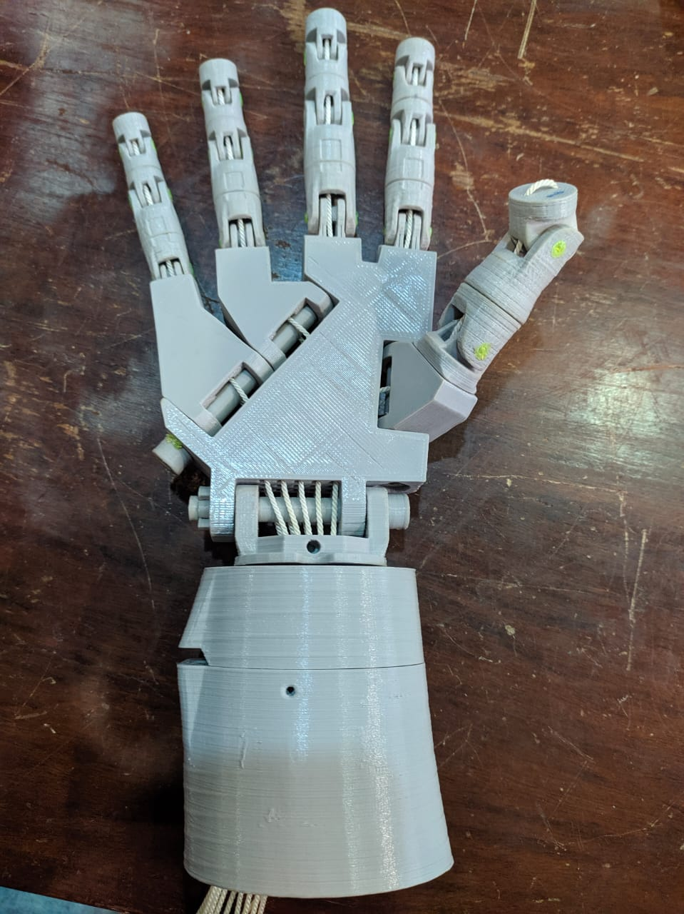
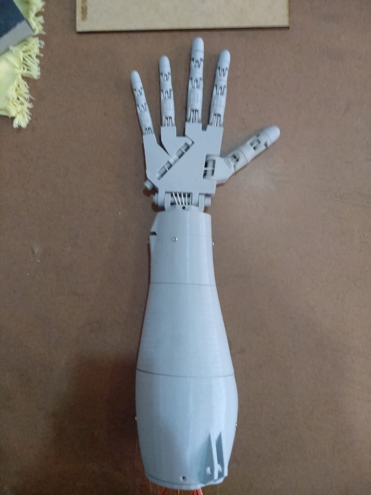
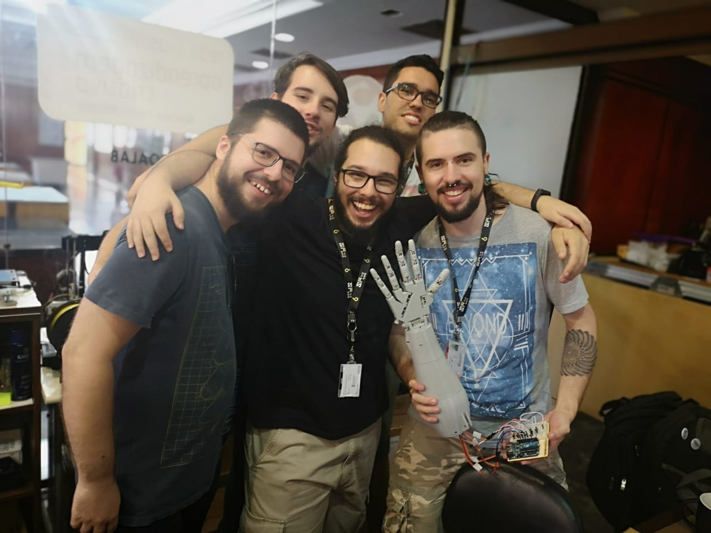

# MaoRobotica IFRS 2019




## Our Fantastic Group 🤖

<div style="display:flex"> 
<a style="text-align:center; margin:15px" href="https://github.com/evandroLutz">
    <br>
    @evandroLutz
</a>
<a style="text-align:center; margin:15px" href="https://github.com/nikolasFreitas">
    <br>
    @nikolasFreitas
</a>
<a style="text-align:center; margin:15px" href="https://github.com/lucaspdroz">
    <br>
    @lucaspdroz
</a>
<a style="text-align:center; margin:15px" href="https://github.com/lucasTovo">
    <br>
    @lucasTovo
</a>
<a style="text-align:center; margin:15px" href="https://github.com/GiovaniBoff">
    <br>
    @GiovaniBoff
</a>
</div>



<br>


## Requirements
> Arduino IDE
> Processing IDE
### Hardware list
- 5x Servo motor MG 995 (Will apply to any 180º servo motor 😉)
- 1x Arduino Board (In this case, we're using UNO - Leonardo, but any can be use too)
- Few Jumpers
- 3D printend Hand [inMoov - Open Source Droid](http://inmoov.fr/hand-and-forarm/)

## Processing IDE
[Download Processing Java-IDE](https://processing.org/download/)

## Arduino IDE
[Download Arduino IDE](https://www.arduino.cc/en/Main/Software)

## Processing libraries
You need to install some libraries to this project work well

>  On Processing IDE > Tools > add tools > Libraries
at Filter, looking for:

```
Video | Gsteramer-based video library for Processing 
Arduino (Firmata) | Controls Arduino boards running the firmata firmware

```

# Step 1

Upload the code into your Arduino

# Step 2

Open your Processing Sketch, some configuration will be needed

Wen we call the Method ```Serial.list()``` All serial ports will be showed at console at bottom of processing IDE

Our Variable port will create a ```new``` instance of ```Serial```,  receiving an List Serial ports, where you will find your port just looking into Arduino IDE

> Tools > Port

Now, you just need to set the serial that your Arduino is Serialized 

```
linux 
macOSX
Windows
```
